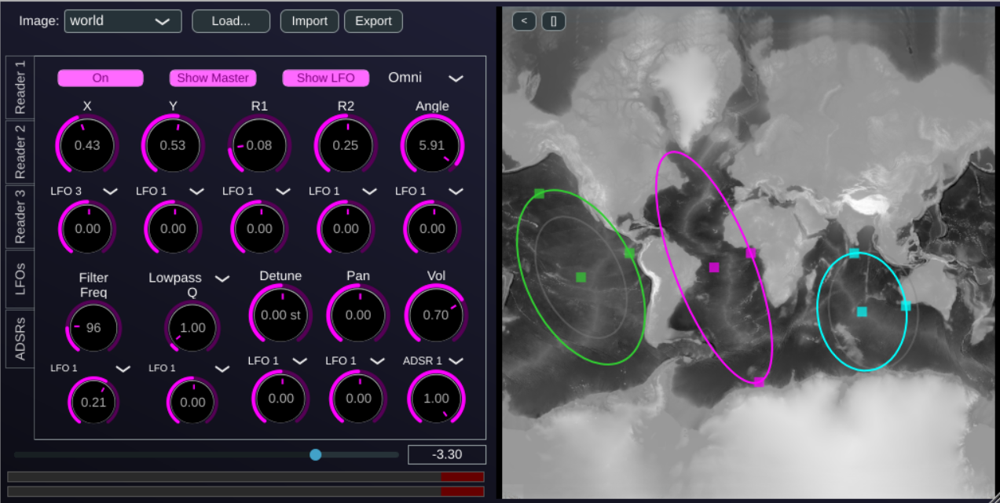

# Image-In, the Image Instrument

Image-In is a polyphonic synthesizer that generates sound by scanning an image. It uses a form of wave terrain synthesis where the brightness of an image's pixels is interpreted as an audio waveform. The path used to scan the image is defined by three independent "Readers", each tracing an elliptical shape.

The shape, position, and orientation of these ellipses can be freely adjusted and modulated by a flexible system of LFOs and ADSR envelopes. This allows for the creation of complex, evolving timbres and rhythmic patterns derived directly from visual information.

## Features

*   **Image-Based Synthesis:** Load any PNG or JPEG image to use as a sound source. The visual characteristics of the image directly influence the timbre of the sound.
*   **Triple Ellipse Readers:** Three independent readers scan the image, each with its own set of parameters (position, radii, angle, volume, pan, detune). Their outputs are mixed together to form the final sound.
*   **Extensive Modulation:**
    *   **4 LFOs:** Each with multiple waveforms, tempo-sync capability, and phase control.
    *   **3 ADSR Envelopes:** For shaping the amplitude and other parameters over time.
    *   A comprehensive modulation matrix allows you to route LFOs and ADSRs to almost any reader parameter, including its geometry, volume, pan, and filter settings.
*   **Per-Reader Filtering:** Each reader has its own multi-mode filter (Low-Pass, High-Pass) to further shape its sound.
*   **Interactive UI:**
    *   An interactive display shows the loaded image and the reader paths.
    *   Drag handles directly on the display to manipulate the center, radii, and angle of the ellipses.
    *   Real-time visualization of parameter modulations.
    *   Switch between a CPU-based renderer and a smoother OpenGL-based renderer.
*   **Preset System:** Comes with a set of factory presets and built-in factory images to get started.

## How to Use

1.  **Load an Image:**
    *   Use the **"Image"** dropdown menu at the top left to select one of the built-in factory images.
    *   Click the **"Load..."** button to open a file dialog and select your own image from your computer. Darker areas of the image produce lower sample values, and brighter areas produce higher values.

2.  **Activate a Reader:**
    *   The plugin has three readers, accessible via the "Reader 1", "Reader 2", and "Reader 3" tabs.
    *   By default, only Reader 1 has its volume turned up. To hear the other readers, go to their respective tabs and increase the **"Volume"** knob.

3.  **Shape the Sound:**
    *   **Directly on the Display:** Click and drag the colored handles on the image display to change the position (center handle), radii (outer handles), and rotation of each ellipse.
    *   **Using the Knobs:** Use the knobs in the "Reader" tabs for more precise control over the ellipse geometry (`CX`, `CY`, `R1`, `R2`, `Angle`), `Volume`, `Pan`, and `Detune`.

4.  **Add Movement with Modulation:**
    *   **LFOs Tab:** Configure the four LFOs. You can set their waveform, speed (`Freq`), and phase. Use the `Sync` button to lock the LFO rate to your DAW's tempo.
    *   **ADSRs Tab:** Adjust the three ADSR envelopes. ADSR 1 is the primary volume envelope by default. ADSR 2 and 3 can be used as modulation sources.
    *   **Assign Modulation:** In each "Reader" tab, below the main parameter knobs, you'll find the modulation controls. For each parameter (e.g., "CX"), you can select a modulation source (e.g., "LFO2") and adjust the modulation `Amount`.

5.  **Filter the Sound:**
    *   In each "Reader" tab, the **Filter** section allows you to apply a filter.
    *   Select a `Filter Type`, and adjust the `Filter Freq` (cutoff/center frequency) and `Filter Q` (quality/resonance). These can also be modulated.

6.  **Final Touches:**
    *   Use the **"Master Volume"** slider at the bottom left to control the overall output level of the plugin.
    *   Click the **"OpenGL"** button to toggle the hardware-accelerated display for smoother animations on supported systems.

## Controls Overview

### Main Display
*   **Image Display:** Shows the currently loaded image.
*   **Reader Paths:** Visualizes the three elliptical reader paths.
    *   **White Path:** The unmodulated, base path for each reader.
    *   **Yellow Path:** The real-time, LFO-modulated path.
    *   **Colored Paths (per-voice):** The final, active path for each synth voice, including all modulations.
*   **Handles:** Colored squares on the display corresponding to each reader. Drag them to edit ellipse parameters.

### Top Bar
*   **Image:** Dropdown to select a factory image.
*   **Load...:** Button to load a custom image.
*   **OpenGL:** Toggles the OpenGL renderer for the display.
*   **Import/Export:** Buttons to load/save the plugin's entire state to an XML file, useful for sharing patches.

### Tabs
*   **Reader 1/2/3:** Controls for each elliptical reader.
    *   `CX`, `CY`: Center position of the ellipse.
    *   `R1`, `R2`: The two radii of the ellipse.
    *   `Angle`: Rotation of the ellipse.
    *   `Volume`, `Pan`, `Detune`: Standard audio parameters for the reader's output.
    *   `Modulation Select/Amount`: Assign a modulation source and depth for each parameter.
    *   `Filter`: Per-reader filter controls.
*   **LFOs:** Contains controls for the 4 LFOs.
*   **ADSRs:** Contains controls for the 3 ADSR envelopes.

### Bottom Bar
*   **Master Volume:** Controls the final output gain.
*   **VU Meters:** Shows the output level for the left and right channels.

## Contact

olivier.doare@ensta.fr
